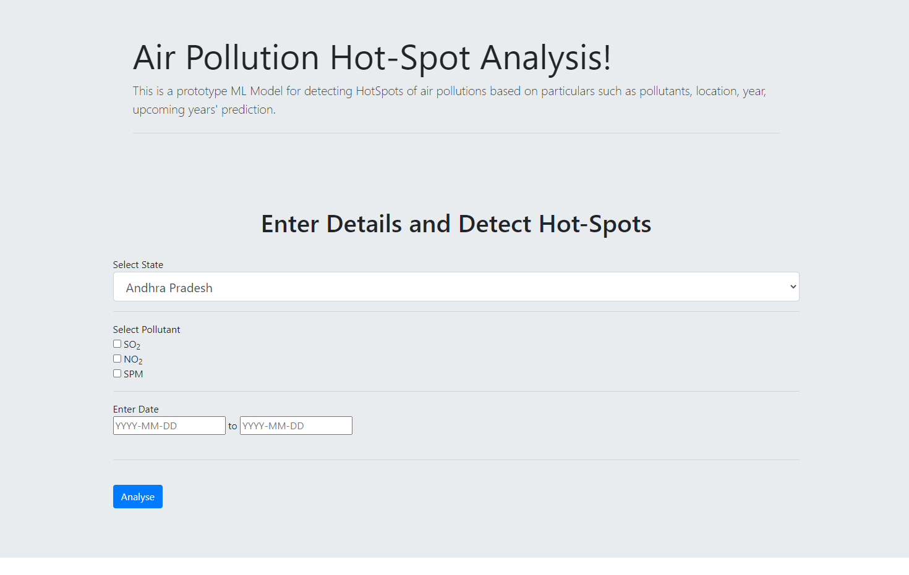

# Air-Pollution-Hot-spot-Detection
Air Pollution Hot-spot detection was a project idea released by ISRO for Smart India Hackathon-2020.  We used ARIMA to detect hot-spots of air pollution classifying it based on the pollutant, time and place.  The project was done by my group of total 6 members.

 

